# Active Directory Setup Project - Complete Documentation

## Table of Contents

1. [Project Overview](#project-overview)
2. [System Requirements](#system-requirements)
3. [Installation and Configuration Steps](#installation-and-configuration-steps)
4. [PowerShell Scripts](#powershell-scripts)
5. [Conclusion](#conclusion)

## Project Overview

This project involves a full setup of an Active Directory service on a Windows Server with the following specifications:

* Domain Name: `laplateforme.io`
* Users: 15 users with different roles
* Groups: 9 organizational groups
* Password Policy: High complexity + mandatory change on first login

## System Requirements

| Component        | Minimum Requirement      |
| ---------------- | ------------------------ |
| Operating System | Windows Server 2019/2022 |
| CPU              | Dual-core                |
| RAM              | 4GB                      |
| Storage          | 40GB                     |
| Network          | Static IP address        |

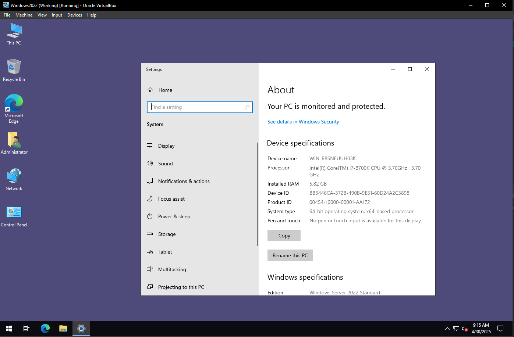

## Installation and Configuration Steps

### 1. Preparing the Server

Install the Active Directory Domain Services role:

```powershell
# Rename the server
Rename-Computer -NewName "AD-SERVER" -Force -Restart

# Set static IP
New-NetIPAddress -IPAddress 192.168.1.100 -PrefixLength 24 -InterfaceIndex (Get-NetAdapter).InterfaceIndex
Set-DnsClientServerAddress -ServerAddresses 192.168.1.100
```

1. Rename the server to something meaningful like AD-SERVER.
2. Assign a static IP address to the server.
3. Update Windows with the latest updates.

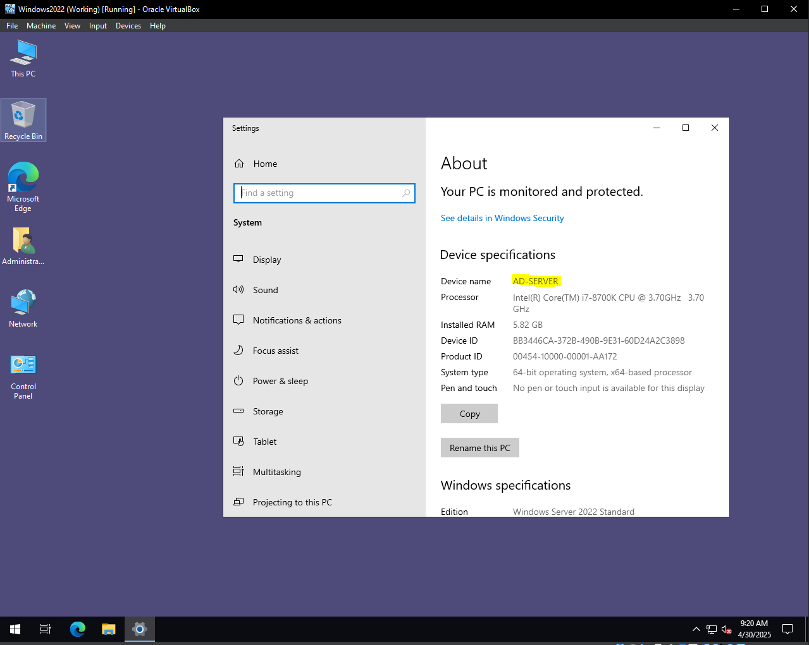
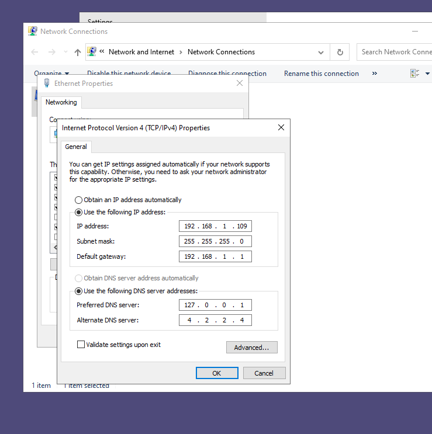

### 2. Installing the Active Directory Role

Now open PowerShell with Administrator privileges.

Install the Active Directory Domain Services role:

```powershell
Install-WindowsFeature -Name AD-Domain-Services -IncludeManagementTools
```

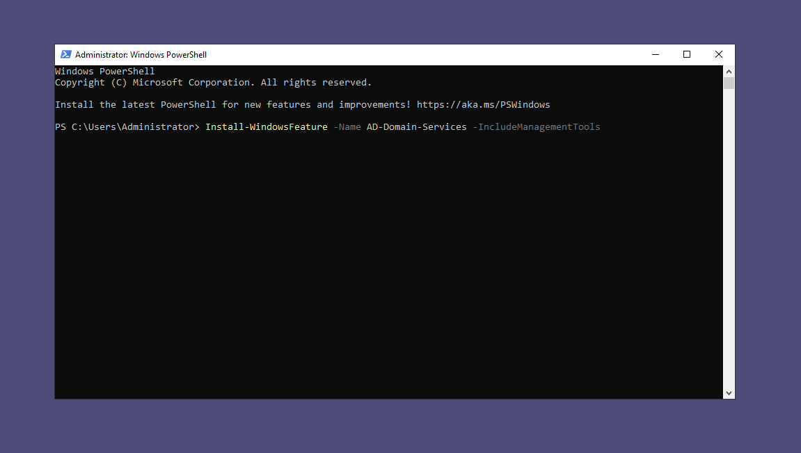
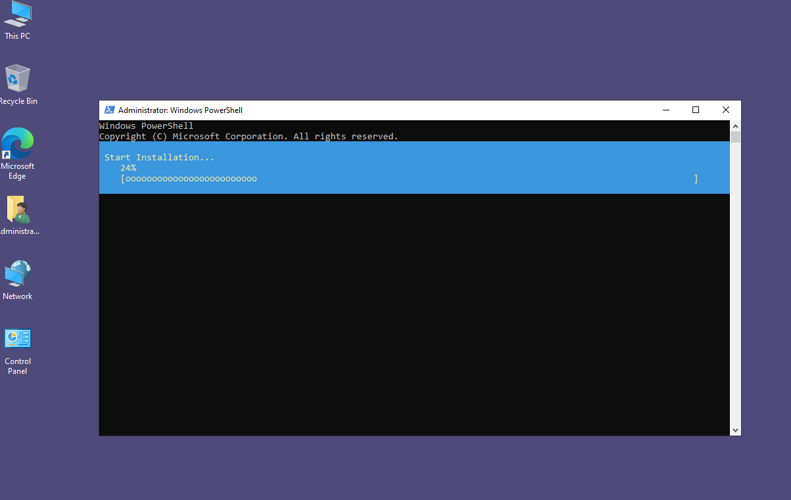
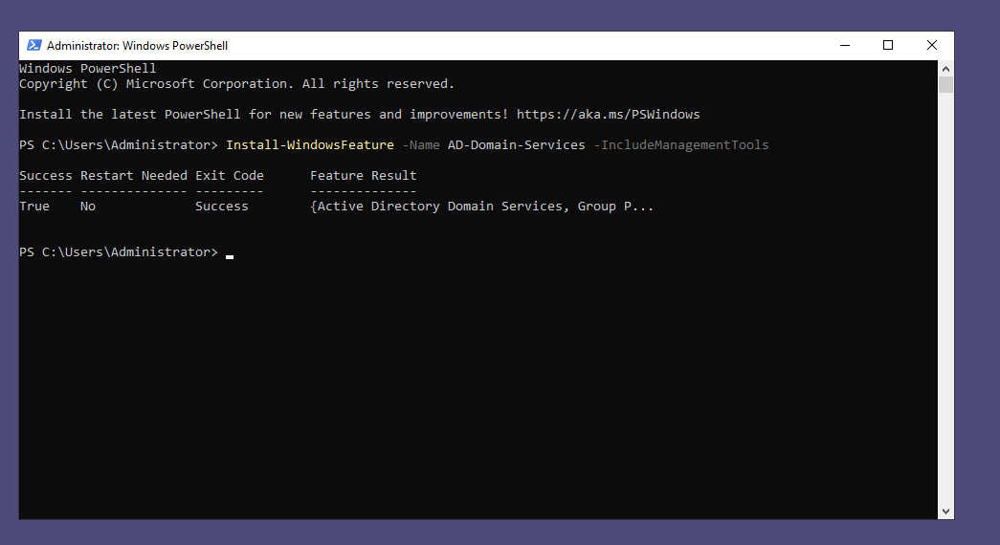

### 3. Creating the `laplateforme.io` Domain

Promote the server to a domain controller:

```powershell
Install-ADDSForest -DomainName "laplateforme.io" -DomainMode "WinThreshold" -ForestMode "WinThreshold" -InstallDns:$true -Force:$true
```

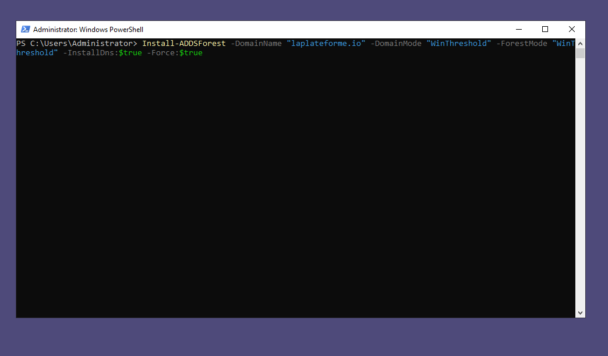

After restart, log in with the domain Administrator account.

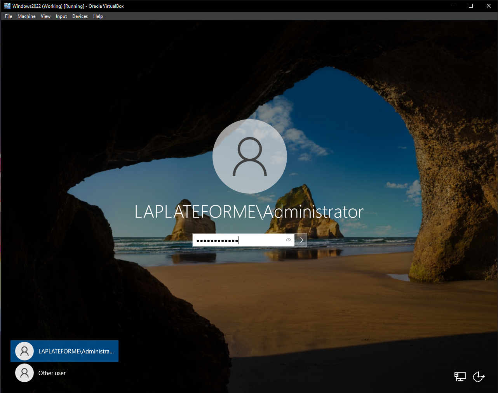

### 4. Creating Users and Groups from a CSV File

Save the CSV file to a suitable path (e.g., `C:\Users\users.csv`).

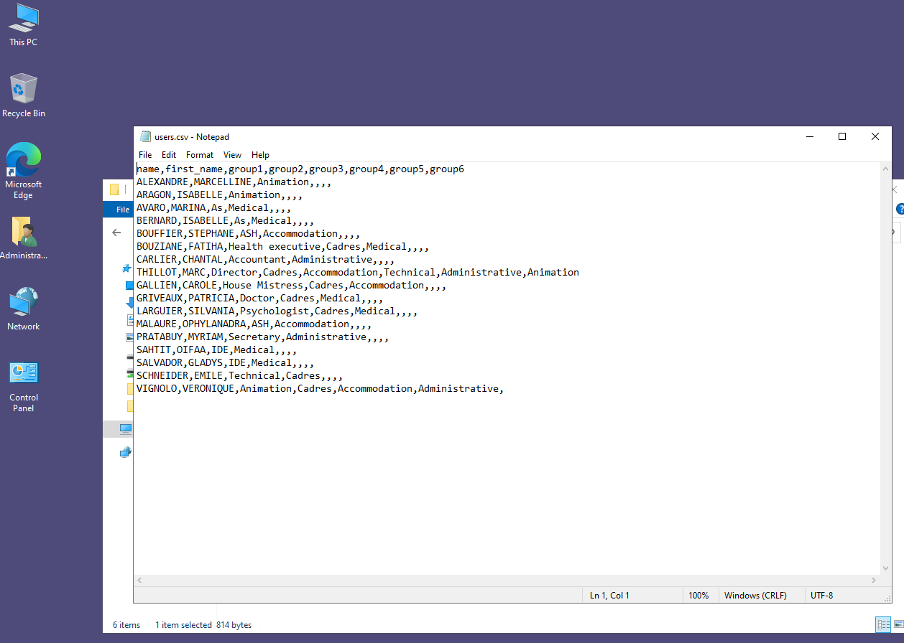

Run the following PowerShell script:

```powershell
# Initial settings
$Domain = "laplateforme.io"
$CSVPath = "C:\Users\users.csv"
$DefaultPassword = ConvertTo-SecureString "Azerty2025!" -AsPlainText -Force

# Import CSV data
$Users = Import-Csv -Path $CSVPath

# Create unique groups
$AllGroups = $Users | ForEach-Object {
    $_.group1, $_.group2, $_.group3, $_.group4, $_.group5, $_.group6
} | Where-Object { $_ -ne "" } | Select-Object -Unique

foreach ($Group in $AllGroups) {
    if (-not (Get-ADGroup -Filter { Name -eq $Group })) {
        New-ADGroup -Name $Group -GroupScope Global -Path "CN=Users,DC=laplateforme,DC=io"
    }
}

# Create users
foreach ($User in $Users) {
    $Username = ($User.first_name.Substring(0,1) + $User.name)
    $SamAccountName = $Username.ToLower()
    $DisplayName = "$($User.first_name) $($User.name)"
    $UserPrincipalName = "$SamAccountName@$Domain"
    
    if (-not (Get-ADUser -Filter { SamAccountName -eq $SamAccountName })) {
        New-ADUser -Name $DisplayName `
                   -GivenName $User.first_name `
                   -Surname $User.name `
                   -SamAccountName $SamAccountName `
                   -UserPrincipalName $UserPrincipalName `
                   -AccountPassword $DefaultPassword `
                   -ChangePasswordAtLogon $true `
                   -Enabled $true `
                   -Path "CN=Users,DC=laplateforme,DC=io"
        
        $Groups = $User.group1, $User.group2, $User.group3, $User.group4, $User.group5, $User.group6 | Where-Object { $_ -ne "" }
        foreach ($Group in $Groups) {
            Add-ADGroupMember -Identity $Group -Members $SamAccountName
        }
    }
}
```

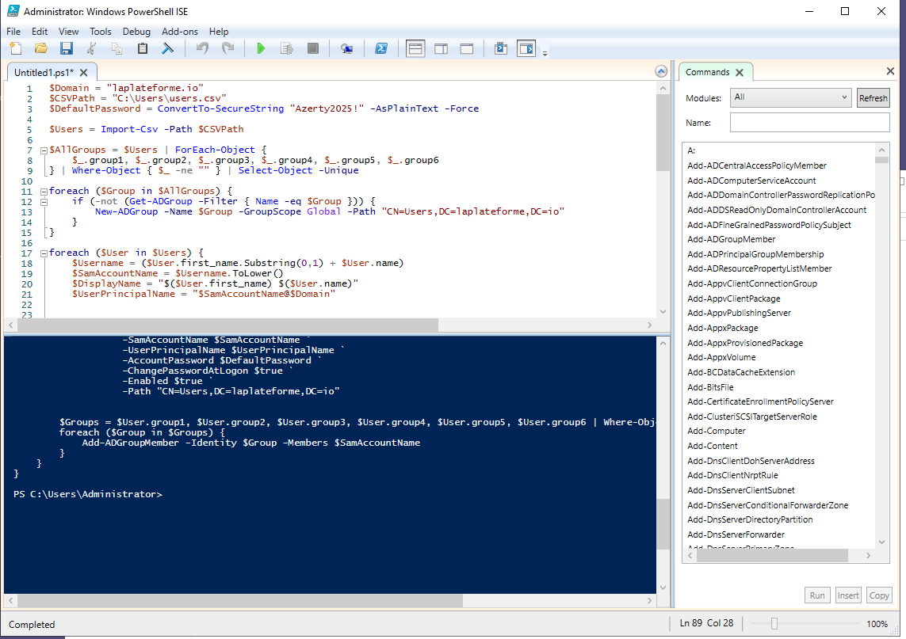

### 5. Setting Password and Security Policies

Configure domain password policy:

```powershell
Set-ADDefaultDomainPasswordPolicy -Identity laplateforme.io `
    -ComplexityEnabled $true `
    -LockoutDuration "00:30:00" `
    -LockoutObservationWindow "00:30:00" `
    -LockoutThreshold 5 `
    -MaxPasswordAge "42.00:00:00" `
    -MinPasswordAge "1.00:00:00" `
    -MinPasswordLength 8 `
    -PasswordHistoryCount 24 `
    -ReversibleEncryptionEnabled $false
```

## PowerShell Scripts

### Main Script (AD-Setup.ps1)

```powershell
# AD-Setup.ps1
# Install AD role
Install-WindowsFeature -Name AD-Domain-Services -IncludeManagementTools

# Create domain
$DomainName = "laplateforme.io"
$SafeModePassword = ConvertTo-SecureString "SafeModePass123!" -AsPlainText -Force

Install-ADDSForest `
    -DomainName $DomainName `
    -DomainMode "WinThreshold" `
    -ForestMode "WinThreshold" `
    -InstallDns:$true `
    -SafeModeAdministratorPassword $SafeModePassword `
    -Force:$true

# After restart, run the script below:
# Import-Module ActiveDirectory
# .\Create-UsersFromCSV.ps1
```

### User Creation Script (Create-UsersFromCSV.ps1)

```powershell
# Create-UsersFromCSV.ps1
param(
    [string]$CSVPath = "C:\Users\users.csv"
)

$Domain = "laplateforme.io"
$DefaultPassword = ConvertTo-SecureString "Azerty2025!" -AsPlainText -Force

# Import CSV data
$Users = Import-Csv -Path $CSVPath

# Create groups
$AllGroups = $Users | ForEach-Object {
    $_.group1, $_.group2, $_.group3, $_.group4, $_.group5, $_.group6
} | Where-Object { $_ -ne "" } | Select-Object -Unique

foreach ($Group in $AllGroups) {
    if (-not (Get-ADGroup -Filter { Name -eq $Group })) {
        try {
            New-ADGroup -Name $Group -GroupScope Global -Path "CN=Users,DC=laplateforme,DC=io"
            Write-Host "Group $Group created successfully." -ForegroundColor Green
        } catch {
            Write-Host "Error creating group $Group : $_" -ForegroundColor Red
        }
    }
}

# Create users
foreach ($User in $Users) {
    $Username = ($User.first_name.Substring(0,1) + $User.name
    $SamAccountName = $Username.ToLower()
    $DisplayName = "$($User.first_name) $($User.name)"
    $UserPrincipalName = "$SamAccountName@$Domain"
    
    if (-not (Get-ADUser -Filter { SamAccountName -eq $SamAccountName })) {
        try {
            New-ADUser -Name $DisplayName `
                      -GivenName $User.first_name `
                      -Surname $User.name `
                      -SamAccountName $SamAccountName `
                      -UserPrincipalName $UserPrincipalName `
                      -AccountPassword $DefaultPassword `
                      -ChangePasswordAtLogon $true `
                      -Enabled $true `
                      -Path "CN=Users,DC=laplateforme,DC=io"
            
            Write-Host "User $DisplayName created successfully." -ForegroundColor Green
            
            $Groups = $User.group1, $User.group2, $User.group3, $User.group4, $User.group5, $User.group6 | Where-Object { $_ -ne "" }
            foreach ($Group in $Groups) {
                try {
                    Add-ADGroupMember -Identity $Group -Members $SamAccountName
                    Write-Host "User $SamAccountName added to group $Group." -ForegroundColor Cyan
                } catch {
                    Write-Host "Error adding user $SamAccountName to group $Group : $_" -ForegroundColor Red
                }
            }
        } catch {
            Write-Host "Error creating user $DisplayName : $_" -ForegroundColor Red
        }
    } else {
        Write-Host "User $DisplayName already exists." -ForegroundColor Yellow
    }
}

Write-Host "User creation process completed." -ForegroundColor Green
```

## Conclusion

In this project, we successfully:

* Prepared a Windows Server to host Active Directory.
* Installed the Active Directory Domain Services role.
* Created the domain `laplateforme.io`.
* Imported 15 users and 9 groups from a CSV file.
* Set the initial password as `Azerty2025!` for all users and enforced change on first login.

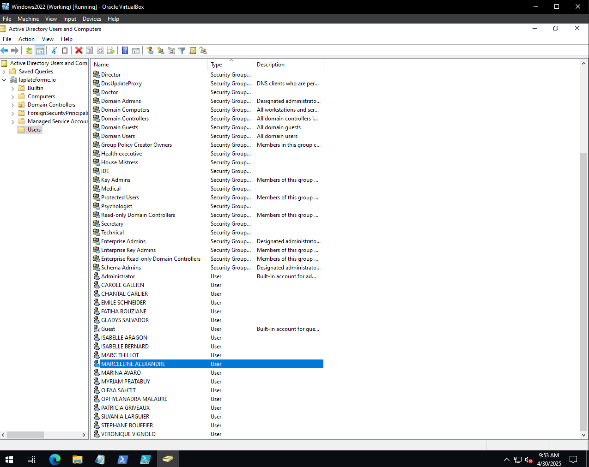
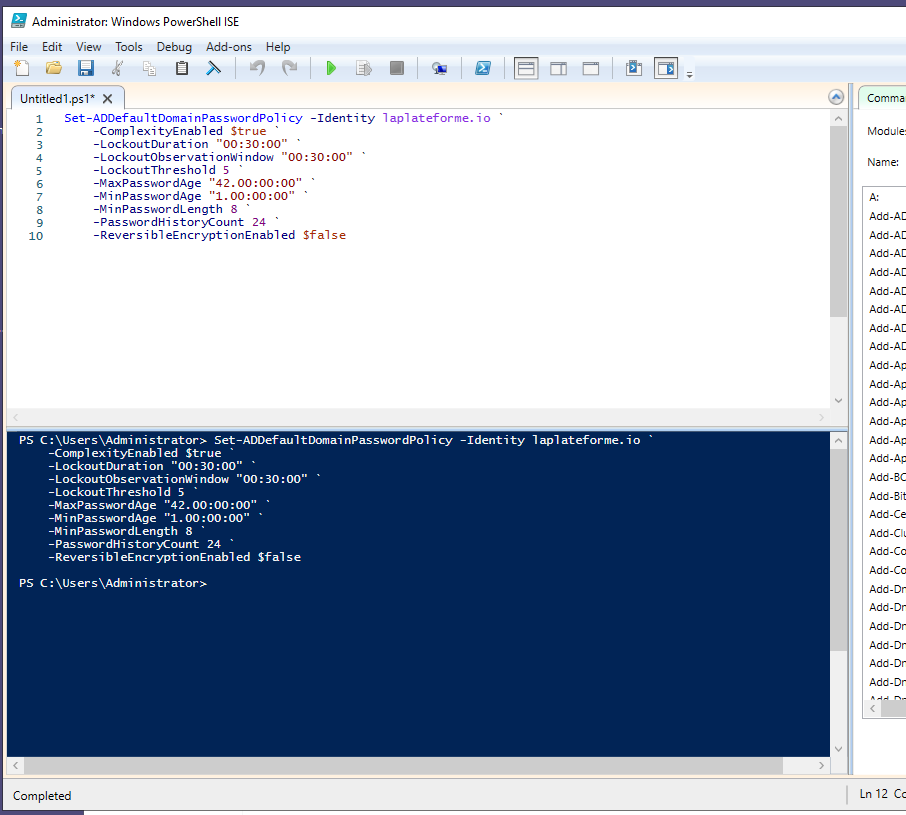
