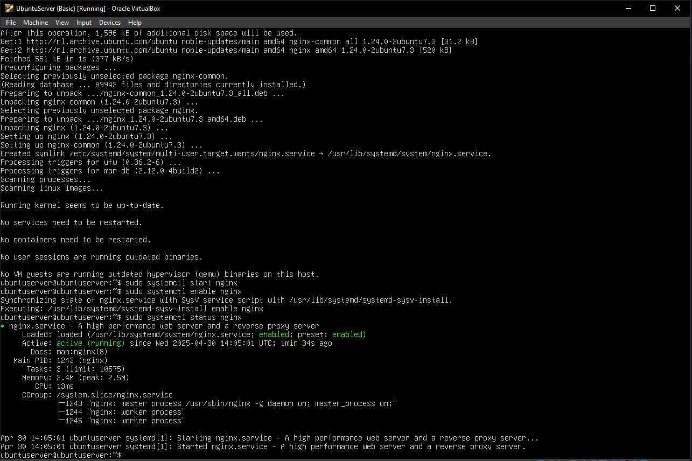
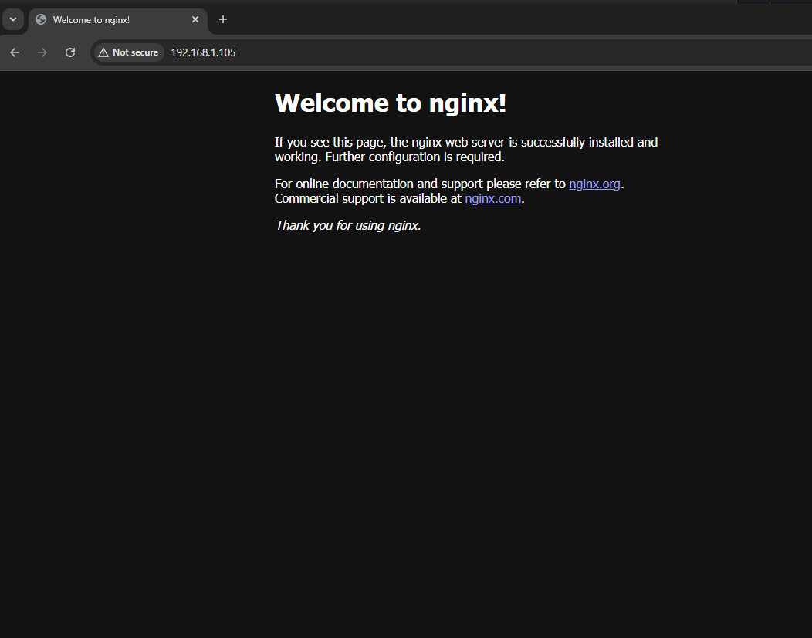
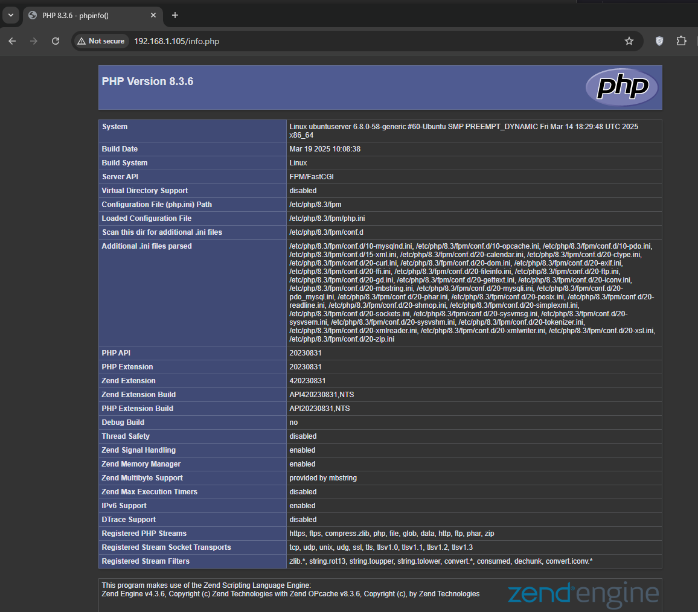
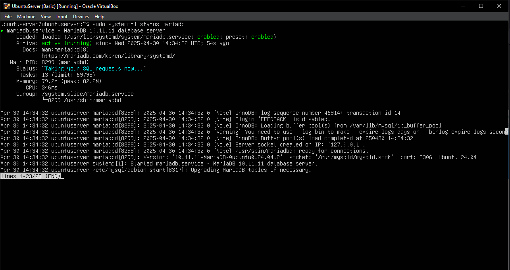
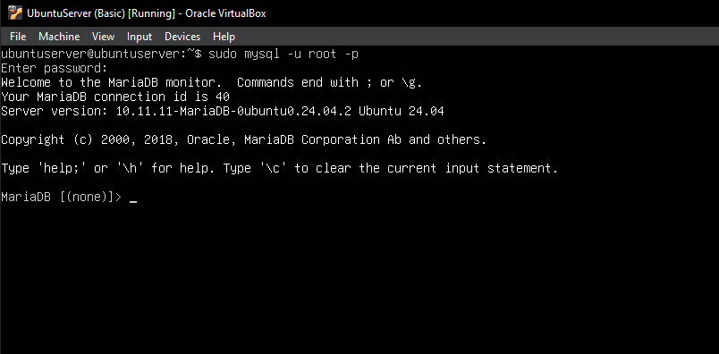
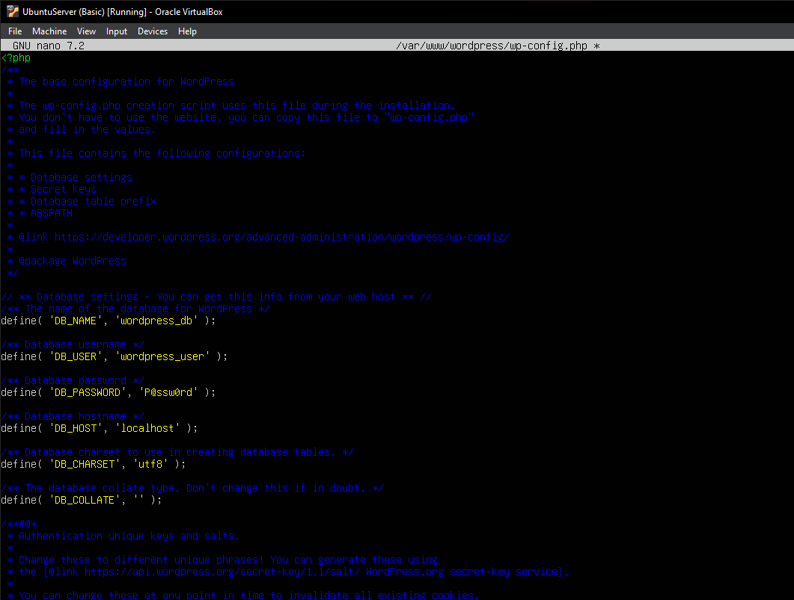
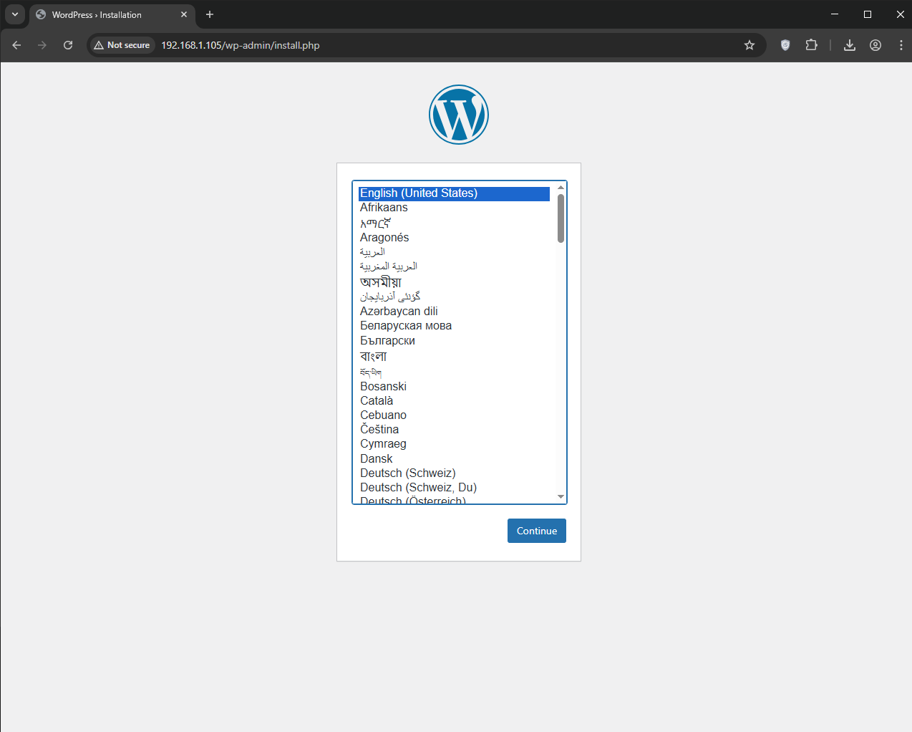

# WordPress Setup with Docker Compose

This project sets up a complete WordPress environment using Docker Compose, including services for Nginx, PHP-FPM, MariaDB, and WordPress itself.

## Table of Contents

1. [Used Services](#used-services)
2. [Shared Volumes](#shared-volumes)
3. [Database Configuration](#database-configuration)
4. [Site Access](#site-access)
5. [Deployment](#deployment)

## Used Services

* **nginx**: Main web server to serve WordPress files
* **php-fpm**: Processes PHP code for WordPress
* **mariadb**: Database management system
* **wordpress**: Core WordPress content management system






## Shared Volumes

To preserve data even after containers are removed, the following volumes are used:

1. `db_data`: Stores MariaDB database data
2. `wordpress_data`: Stores WordPress core files
3. `nginx_config`: Stores Nginx configuration files

## Database Configuration

Database configuration is handled in the `docker-compose.yaml` file with the following details:

* Database name: `wordpress`
* Database user: `wordpress`
* Password: `wordpress123`
* Database host: `mariadb` (Docker Compose service name)

This information is used by WordPress during setup to connect to the database.




## Site Access

After setup, WordPress will be accessible at:

```
http://localhost:8080
```



## Deployment

1. Make sure Docker and Docker Compose are installed on your system.
2. Save the project files in a directory.
3. Open a terminal, navigate to the project directory, and run:

```bash
docker-compose up -d
```

4. Once the setup completes, open your browser and go to `http://localhost:8080`.
5. Follow the WordPress installation steps.

To stop the services:

```bash
docker-compose down
```

---

## Project Files

### 1. docker-compose.yaml

```yaml
version: '3.8'

services:
  mariadb:
    image: mariadb:latest
    container_name: wp_mariadb
    restart: always
    environment:
      MYSQL_ROOT_PASSWORD: root123
      MYSQL_DATABASE: wordpress
      MYSQL_USER: wordpress
      MYSQL_PASSWORD: wordpress123
    volumes:
      - db_data:/var/lib/mysql
    networks:
      - wp_network

  php:
    image: php:fpm
    container_name: wp_php
    restart: always
    volumes:
      - wordpress_data:/var/www/html
    networks:
      - wp_network

  wordpress:
    image: wordpress:latest
    container_name: wp_wordpress
    restart: always
    depends_on:
      - mariadb
    environment:
      WORDPRESS_DB_HOST: mariadb
      WORDPRESS_DB_USER: wordpress
      WORDPRESS_DB_PASSWORD: wordpress123
      WORDPRESS_DB_NAME: wordpress
    volumes:
      - wordpress_data:/var/www/html
    networks:
      - wp_network

  nginx:
    image: nginx:latest
    container_name: wp_nginx
    restart: always
    ports:
      - "8080:80"
    volumes:
      - wordpress_data:/var/www/html
      - ./nginx.conf:/etc/nginx/conf.d/default.conf
    depends_on:
      - php
      - wordpress
    networks:
      - wp_network

volumes:
  db_data:
  wordpress_data:

networks:
  wp_network:
    driver: bridge
```

### 2. nginx.conf

```nginx
server {
    listen 80;
    server_name localhost;

    root /var/www/html;
    index index.php index.html index.htm;

    access_log /var/log/nginx/access.log;
    error_log /var/log/nginx/error.log;

    location / {
        try_files $uri $uri/ /index.php?$args;
    }

    location ~ \.php$ {
        try_files $uri =404;
        fastcgi_split_path_info ^(.+\.php)(/.+)$;
        fastcgi_pass php:9000;
        fastcgi_index index.php;
        include fastcgi_params;
        fastcgi_param SCRIPT_FILENAME $document_root$fastcgi_script_name;
        fastcgi_param PATH_INFO $fastcgi_path_info;
    }

    location ~ /\.ht {
        deny all;
    }

    location = /favicon.ico {
        log_not_found off;
        access_log off;
    }

    location = /robots.txt {
        allow all;
        log_not_found off;
        access_log off;
    }

    location ~* \.(js|css|png|jpg|jpeg|gif|ico)$ {
        expires max;
        log_not_found off;
    }
}
```

## Final Notes

1. These settings are intended for development; production environments require additional security configurations.
2. Port 8080 is used to avoid conflicts with other services.
3. All database and WordPress files are stored in volumes, so they persist even after containers are deleted.
4. You can modify configurations (e.g., passwords, ports) in the `docker-compose.yaml` file.

# Docker and Docker Compose Installation Guide

## Installing Docker

### On Debian/Ubuntu-based systems:

1. **Update packages**:

   ```bash
   sudo apt update
   sudo apt upgrade -y
   ```

2. **Install dependencies**:

   ```bash
   sudo apt install -y apt-transport-https ca-certificates curl software-properties-common
   ```

3. **Add Docker’s official GPG key**:

   ```bash
   curl -fsSL https://download.docker.com/linux/ubuntu/gpg | sudo gpg --dearmor -o /usr/share/keyrings/docker-archive-keyring.gpg
   ```

4. **Add Docker repository**:

   ```bash
   echo "deb [arch=$(dpkg --print-architecture) signed-by=/usr/share/keyrings/docker-archive-keyring.gpg] https://download.docker.com/linux/ubuntu $(lsb_release -cs) stable" | sudo tee /etc/apt/sources.list.d/docker.list > /dev/null
   ```

5. **Install Docker Engine**:

   ```bash
   sudo apt update
   sudo apt install -y docker-ce docker-ce-cli containerd.io
   ```

6. **Add user to the docker group** (to run Docker without `sudo`):

   ```bash
   sudo usermod -aG docker $USER
   newgrp docker
   ```

7. **Verify installation**:

   ```bash
   docker --version
   sudo systemctl status docker
   ```

### On RHEL/CentOS-based systems:

1. **Remove old versions**:

   ```bash
   sudo yum remove docker docker-client docker-client-latest docker-common docker-latest docker-latest-logrotate docker-logrotate docker-engine
   ```

2. **Install dependencies**:

   ```bash
   sudo yum install -y yum-utils
   ```

3. **Add Docker repository**:

   ```bash
   sudo yum-config-manager --add-repo https://download.docker.com/linux/centos/docker-ce.repo
   ```

4. **Install Docker Engine**:

   ```bash
   sudo yum install -y docker-ce docker-ce-cli containerd.io
   ```

5. **Start and enable the service**:

   ```bash
   sudo systemctl start docker
   sudo systemctl enable docker
   ```

6. **Add user to the docker group**:

   ```bash
   sudo usermod -aG docker $USER
   newgrp docker
   ```

## Installing Docker Compose

### Recommended method (latest version):

1. **Download Docker Compose**:

   ```bash
   sudo curl -L "https://github.com/docker/compose/releases/latest/download/docker-compose-$(uname -s)-$(uname -m)" -o /usr/local/bin/docker-compose
   ```

2. **Make it executable**:

   ```bash
   sudo chmod +x /usr/local/bin/docker-compose
   ```

3. **Create a symlink (optional)**:

   ```bash
   sudo ln -s /usr/local/bin/docker-compose /usr/bin/docker-compose
   ```

4. **Verify installation**:

   ```bash
   docker-compose --version
   ```

### Alternative method (via package manager):

For Ubuntu/Debian:

```bash
sudo apt install -y docker-compose-plugin
```

For RHEL/CentOS:

```bash
sudo yum install -y docker-compose-plugin
```

## Initial Testing

1. **Test Docker**:

   ```bash
   docker run hello-world
   ```

2. **Test Docker Compose**:

   ```bash
   docker-compose version
   ```

## Post-Installation Tips

1. **Regular updates**:

   ```bash
   sudo apt update && sudo apt upgrade -y  # Debian/Ubuntu
   sudo yum update -y                      # RHEL/CentOS
   ```

2. **Permission issues**:
   Use `sudo` or ensure the user is added to the `docker` group.

3. **Optional configurations**:

   * Change default storage path
   * Set resource limits
   * Configure proxy (if needed)

## Troubleshooting

If you encounter issues:

1. Check logs:

   ```bash
   journalctl -xu docker
   ```

2. Check Docker service status:

   ```bash
   sudo systemctl status docker
   ```

3. Confirm versions:

   ```bash
   docker --version
   docker-compose --version
   ```
